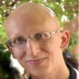
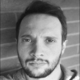
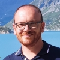

# Organizers

<a href="#">

    
    Simone  Palazzo
    University of Catania

</a>
<a href="#">

    
    Angelo  Porrello
    University of Modena and Reggio Emilia

</a>
<a href="#">

    
    Matteo  Boschini
    University of Modena and Reggio Emilia

</a>
<a href="#">

    
    Giovanni  Bellitto
    University of Catania

</a>
<a href="#">

    
    Vincenzo  Lomonaco
    University of Pisa

</a>

# Program Committee

To be determined.

<!--<ul>
  <li>Pietro Buzzega (Covision Lab)</li>
  <li>Matthias De Lange (KU Leuven)</li>
  <li>Arthur Douillard (Sorbonne University)</li>
  <li>Sebastian Farquhar (University of Oxford)</li>
  <li>Bartosz Krawczyk (Virginia Commonwealth University)</li>
  <li>Marc Masana (Graz University of Technology)</li>
  <li>Seyed Iman Mirzadeh (Washington State University)</li>
  <li>Gido Van De Ven (Baylor College of Medicine)</li>
  <li>Joost van de Weijer (Universitat Autònoma de Barcelona)</li>
  <li>Johannes von Oswald (ETH Zurich)</li>
  <li>James Smith (Georgia Institute of Technology)</li>
  <li>Mehrdad Farajtabar (Google Deepmind)</li>
  <li>Timothée Lesort (MILA, University of Montreal)</li>
</ul>-->

# Contact

If you need any additional information, please [write us an email](mailto:simone.palazzo@unict.it).
